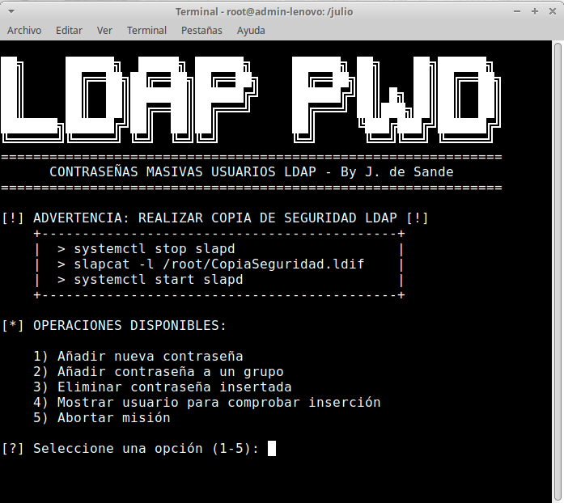

# Generador de Contraseñas Masivas

El objetivo de este script es añadir contraseñas masivas **extra** a grupos de usuarios ldap del sistema,
para facilitar la administración informática

 

## Casos de uso

Puede ser útil para las siguientes situaciónes:

1. **Asistencia a un profesor en el aula:**
   Si disponemos de una contraseña secreta pero fácil de recordar, la asistencia cuando el profesor da clases será más sencilla.
2. **Pruebas de diágnostico:**
   Podemos generar una contraseña temporal sencilla para los alumnos. Así se agilizan el acceso a ordenadores, práctico cuando muchos alumnos están realizando una prueba.
3. **Contraseñas para grupos:**
   Se pueden generar contraseñas para grupos concretos que trabajen mucho con ordenadores, como por elemplo los alumnos de Informática.

## Descripción de las opciones del Menú.
1. Añadir nueva contraseña.
   Nos permite añadir una contraseña masiva extra. ( Las anteriores contraseñas que tuviesen los usuarios no se tocan)
   Nos permite añadirla a a los "Alumnos" , "Profesores" a todos. Nos permite almacenar la contraseña en texto plano o codificada. Por seguridad se aconseja almacenar la contraseña codificada a pesar de que el algorimo SHA1 no es de los más
   seguros ( tiene colisiones )
   
3. Añadir contraseña a un grupo.
4. Eliminar contraseña insertada.
5. Mostrar usuario para comprobar inserción
6. Abortar Misión.


## Puesta en marcha

1. Editar el script, cambiando la variable: "mi_servidor_ldap"
2. En un equipo cliente con Xubuntu 22 (no ejecutar en el servidor): 
```bash
    apt-get install python3-pip
    pip3 install ldap3
```
3. Ejecutar script: 
```bash
    python3 add_password_lusers.py
```

## Copia de Seguridad de Ldap.

Es importante realizar una copia de seguridad de ldap antes de ejecutar el script.
El script está probado por distintos compañeros, pero la modificar el árbol ldap, se recomienda hacer una copia de seguridad.

### Generar copia de seguridad de ldap
```bash
systemctl stop slapd                   
slapcat -l /root/CopiaSeguridad.ldif    
systemctl start slapd                                                                    
```

### Restablecer copia de seguridad de ldap
```bash
slapadd -n 1 -l CopiadSeguridad.ldif
```
